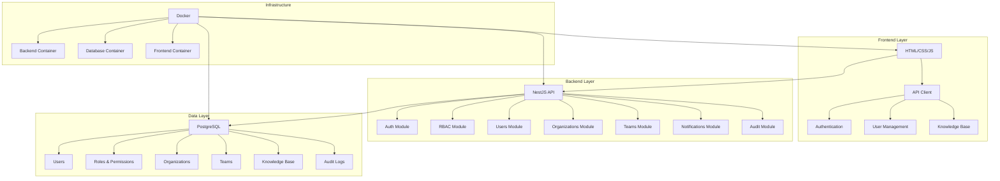

# 🚀 Vselena - Система управления базой знаний и поддержкой

<div align="center">


**Современная система управления знаниями с полной аутентификацией, RBAC и системой приглашений**

[🌐 Демо](https://vselena.ldmco.ru) • [📚 Документация API](https://vselena.ldmco.ru/api/docs) • [🐛 Сообщить об ошибке](https://github.com/startupus/vselena_back/issues)

</div>

---

## 📋 Содержание

- [🎯 О проекте](#-о-проекте)
- [✨ Ключевые возможности](#-ключевые-возможности)
- [🏗️ Архитектура системы](#️-архитектура-системы)
- [🛠️ Технологический стек](#️-технологический-стек)
- [📁 Структура проекта](#-структура-проекта)
- [🚀 Быстрый старт](#-быстрый-старт)
- [🔐 Учетные данные](#-учетные-данные)
- [📊 API Endpoints](#-api-endpoints)
- [🔒 Безопасность](#-безопасность)
- [🐳 Docker](#-docker)
- [📈 Мониторинг и логирование](#-мониторинг-и-логирование)
- [🤝 Вклад в проект](#-вклад-в-проект)

---

## 🎯 О проекте

**Vselena** — это полнофункциональная система управления базой знаний и поддержкой клиентов, разработанная для современных команд и организаций. Система обеспечивает централизованное хранение знаний, эффективное управление пользователями и гибкую систему ролей и прав доступа.

### 🎨 Дизайн-философия

- **🔐 Безопасность прежде всего** — многоуровневая система аутентификации и авторизации
- **👥 Командная работа** — гибкое управление организациями и командами
- **📚 Централизованные знания** — единая база знаний для всей организации
- **🎯 Простота использования** — интуитивно понятный интерфейс
- **⚡ Высокая производительность** — оптимизированная архитектура

---

## ✨ Ключевые возможности

### 🔐 Аутентификация и безопасность
- **JWT аутентификация** с access/refresh токенами
- **Двухфакторная аутентификация (2FA)** через email
- **Вход по коду с почты** для быстрого доступа
- **Сброс пароля** через email с безопасными токенами
- **Умная аутентификация** — система определяет существующих пользователей

### 👥 Управление пользователями
- **Система приглашений** — приглашение пользователей в команды и организации
- **Контекстные роли** — роли привязаны к конкретным командам/организациям
- **Гибкое управление ролями** — назначение и изменение ролей
- **Переводы между командами** — перемещение сотрудников между командами

### 🏢 Организационная структура
- **Многоуровневая иерархия** — организации → команды → пользователи
- **Гибкие роли** — системные и кастомные роли
- **Права доступа** — гранулярная система разрешений
- **Аудит действий** — полное логирование всех операций

### 📚 База знаний
- **Централизованное хранение** — все знания в одном месте
- **Категоризация** — структурированная организация материалов
- **Поиск и фильтрация** — быстрый поиск нужной информации
- **Версионирование** — отслеживание изменений в документах

### 🎨 Современный интерфейс
- **Адаптивный дизайн** — работает на всех устройствах
- **Интуитивная навигация** — понятный пользовательский интерфейс
- **Темная/светлая тема** — настройка под предпочтения пользователя
- **Быстрые действия** — контекстные меню и горячие клавиши

---

## 🏗️ Архитектура системы



### 🔄 Поток данных

1. **Пользователь** взаимодействует с Frontend
2. **Frontend** отправляет запросы в Backend API
3. **Backend** обрабатывает запросы через модули
4. **Модули** взаимодействуют с базой данных
5. **Данные** возвращаются пользователю через API

---

## 🛠️ Технологический стек

### 🎨 Frontend
| Технология | Версия | Назначение |
|------------|--------|------------|
| **HTML5** | Latest | Семантическая разметка |
| **CSS3** | Latest | Стилизация и анимации |
| **JavaScript (ES6+)** | Latest | Логика приложения |
| **Fetch API** | Native | HTTP запросы |
| **Responsive Design** | - | Адаптивность |

### ⚙️ Backend
| Технология | Версия | Назначение |
|------------|--------|------------|
| **Node.js** | 18+ | JavaScript runtime |
| **NestJS** | 10+ | Прогрессивный Node.js фреймворк |
| **TypeScript** | 5+ | Типизированный JavaScript |
| **TypeORM** | 0.3+ | ORM для работы с БД |
| **PostgreSQL** | 15+ | Основная база данных |
| **JWT** | 9+ | Аутентификация |
| **bcrypt** | 5+ | Хеширование паролей |
| **Swagger** | 7+ | API документация |
| **Passport** | 0.6+ | Стратегии аутентификации |

### 🐳 Инфраструктура
| Технология | Версия | Назначение |
|------------|--------|------------|
| **Docker** | 24+ | Контейнеризация |
| **Docker Compose** | 2+ | Оркестрация контейнеров |
| **Nginx** | 1.24+ | Reverse proxy |
| **Git** | 2.40+ | Контроль версий |

### 🔧 Инструменты разработки
| Технология | Назначение |
|------------|------------|
| **ESLint** | Линтинг кода |
| **Prettier** | Форматирование кода |
| **Jest** | Тестирование |
| **GitHub Actions** | CI/CD |

---

## 📁 Структура проекта

```
vselena_back/
├── 📁 .cursor/                          # Настройки Cursor IDE
│   └── rules                            # Правила разработки
├── 📁 frontend/                         # Frontend приложение
│   ├── 📄 index.html                   # Главная страница авторизации
│   ├── 📄 dashboard.html               # Основной дашборд
│   ├── 📄 reset-password.html          # Страница сброса пароля
│   ├── 📁 js/                          # JavaScript модули
│   │   ├── api-config.js              # Конфигурация API
│   │   └── auth.js                    # Логика аутентификации
│   └── 📁 css/                         # Стили (встроенные в HTML)
├── 📁 vselena-backend/                 # Backend приложение (NestJS)
│   ├── 📁 src/                         # Исходный код
│   │   ├── 📁 auth/                    # Модуль аутентификации
│   │   │   ├── 📁 micro-modules/       # Микромодули
│   │   │   │   ├── 📁 invitations/     # Система приглашений
│   │   │   │   ├── 📁 two-factor/      # 2FA аутентификация
│   │   │   │   ├── 📁 email-code/      # Вход по коду с почты
│   │   │   │   └── 📁 role-promotion/  # Повышение ролей
│   │   │   ├── 📁 guards/              # Guards для защиты endpoints
│   │   │   ├── 📁 decorators/          # Декораторы (@CurrentUser, @Public)
│   │   │   ├── 📁 strategies/          # Passport стратегии
│   │   │   └── 📁 dto/                 # Data Transfer Objects
│   │   ├── 📁 users/                   # Управление пользователями
│   │   │   ├── 📁 entities/            # TypeORM сущности
│   │   │   ├── 📁 dto/                 # DTO для пользователей
│   │   │   └── 📁 services/            # Бизнес-логика
│   │   ├── 📁 rbac/                    # Роли и права доступа
│   │   │   ├── 📁 entities/            # Сущности ролей и прав
│   │   │   └── 📁 services/            # Логика RBAC
│   │   ├── 📁 organizations/           # Управление организациями
│   │   ├── 📁 teams/                   # Управление командами
│   │   ├── 📁 notifications/           # Система уведомлений
│   │   ├── 📁 audit/                   # Аудит действий пользователей
│   │   ├── 📁 common/                  # Общие утилиты
│   │   │   ├── 📁 decorators/          # Общие декораторы
│   │   │   ├── 📁 filters/             # Exception фильтры
│   │   │   ├── 📁 interceptors/        # Interceptors
│   │   │   └── 📁 pipes/               # Validation pipes
│   │   ├── 📁 config/                  # Конфигурация приложения
│   │   ├── 📁 database/                # База данных
│   │   │   ├── 📁 migrations/          # Миграции БД
│   │   │   └── 📁 seeds/               # Начальные данные
│   │   └── 📄 main.ts                  # Точка входа приложения
│   ├── 📁 test/                        # Тесты
│   ├── 📄 docker-compose.yml          # Docker Compose конфигурация
│   ├── 📄 Dockerfile                  # Docker образ для Backend
│   ├── 📄 package.json                # Зависимости Node.js
│   └── 📄 tsconfig.json               # Конфигурация TypeScript
├── 📄 .gitignore                       # Игнорируемые файлы Git
├── 📄 README.md                        # Документация проекта
└── 📄 *.md                            # Дополнительная документация
```

### 🎯 Назначение папок

#### Frontend (`/frontend/`)
- **`index.html`** — Главная страница с системой авторизации
- **`dashboard.html`** — Основной интерфейс системы после входа
- **`reset-password.html`** — Страница восстановления пароля
- **`js/`** — JavaScript модули для логики приложения
- **`css/`** — Стили (встроенные в HTML для простоты развертывания)

#### Backend (`/vselena-backend/`)
- **`src/auth/`** — Полная система аутентификации и авторизации
- **`src/users/`** — Управление пользователями и их профилями
- **`src/rbac/`** — Система ролей и прав доступа (RBAC)
- **`src/organizations/`** — Управление организациями
- **`src/teams/`** — Управление командами
- **`src/notifications/`** — Система уведомлений
- **`src/audit/`** — Аудит действий пользователей
- **`src/database/`** — Миграции и начальные данные БД
- **`src/common/`** — Общие утилиты и компоненты

---

## 🚀 Быстрый старт

### 📋 Предварительные требования

- **Docker** 24.0+ и **Docker Compose** 2.0+
- **Git** 2.40+
- **Node.js** 18+ (для разработки)
- **PostgreSQL** 15+ (для локальной разработки)

### 1️⃣ Клонирование репозитория

```bash
git clone https://github.com/startupus/vselena_back.git
cd vselena_back
```

### 2️⃣ Запуск через Docker Compose

```bash
cd vselena-backend
docker-compose up -d
```

### 3️⃣ Проверка запуска

```bash
# Проверка статуса контейнеров
docker-compose ps

# Просмотр логов
docker-compose logs -f backend
```

### 4️⃣ Доступ к приложению

| Сервис | URL | Описание |
|--------|-----|----------|
| 🌐 **Frontend** | http://localhost:3000 | Основное приложение |
| ⚙️ **Backend API** | http://localhost:3001 | REST API |
| 📚 **API Docs** | http://localhost:3001/api/docs | Swagger документация |
| 🗄️ **Database Admin** | http://localhost:8080 | Администрирование БД |

---

## 🔐 Учетные данные

### 👑 Администратор системы
- **Email**: `admin@vselena.ru`
- **Пароль**: `admin123`
- **Роль**: Super Admin (полный доступ)

### 👥 Тестовые пользователи

| Email | Пароль | Роль | Описание |
|-------|--------|------|----------|
| `saschkaproshka04@mail.ru` | `22222222` | Manager | Менеджер команды |
| `test@example.com` | `test123` | Editor | Редактор контента |
| `viewer@example.com` | `viewer123` | Viewer | Только просмотр |

---

## 📊 API Endpoints

### 🔐 Аутентификация

| Метод | Endpoint | Описание | Авторизация |
|-------|----------|----------|-------------|
| `POST` | `/api/auth/login` | Вход в систему | ❌ |
| `POST` | `/api/auth/register` | Регистрация | ❌ |
| `POST` | `/api/auth/refresh` | Обновление токена | ❌ |
| `POST` | `/api/auth/logout` | Выход из системы | ❌ |
| `GET` | `/api/auth/me` | Текущий пользователь | ✅ |
| `POST` | `/api/auth/email-code/send` | Отправка кода на email | ❌ |
| `POST` | `/api/auth/email-code/login` | Вход по коду | ❌ |
| `POST` | `/api/auth/2fa/email/send-code` | Отправка 2FA кода | ✅ |
| `POST` | `/api/auth/2fa/email/verify` | Проверка 2FA кода | ✅ |

### 👥 Пользователи

| Метод | Endpoint | Описание | Авторизация |
|-------|----------|----------|-------------|
| `GET` | `/api/users` | Список пользователей | ✅ |
| `POST` | `/api/users` | Создать пользователя | ✅ |
| `GET` | `/api/users/:id` | Получить пользователя | ✅ |
| `PATCH` | `/api/users/:id` | Обновить пользователя | ✅ |
| `DELETE` | `/api/users/:id` | Удалить пользователя | ✅ |
| `POST` | `/api/users/check-email` | Проверить email | ❌ |
| `POST` | `/api/users/:id/change-role` | Изменить роль | ✅ |
| `POST` | `/api/users/:id/transfer` | Перевести в команду | ✅ |

### 🏢 Организации и команды

| Метод | Endpoint | Описание | Авторизация |
|-------|----------|----------|-------------|
| `GET` | `/api/organizations` | Список организаций | ✅ |
| `POST` | `/api/organizations` | Создать организацию | ✅ |
| `GET` | `/api/teams` | Список команд | ✅ |
| `POST` | `/api/teams` | Создать команду | ✅ |

### 📨 Приглашения

| Метод | Endpoint | Описание | Авторизация |
|-------|----------|----------|-------------|
| `GET` | `/api/invitations/my` | Мои приглашения | ✅ |
| `GET` | `/api/invitations/sent` | Отправленные приглашения | ✅ |
| `POST` | `/api/invitations` | Создать приглашение | ✅ |
| `POST` | `/api/invitations/:id/accept` | Принять приглашение | ✅ |
| `DELETE` | `/api/invitations/:id` | Отменить приглашение | ✅ |

### 🔔 Уведомления

| Метод | Endpoint | Описание | Авторизация |
|-------|----------|----------|-------------|
| `GET` | `/api/notifications` | Список уведомлений | ✅ |
| `PATCH` | `/api/notifications/:id/read` | Отметить как прочитанное | ✅ |
| `DELETE` | `/api/notifications/:id` | Удалить уведомление | ✅ |

---

## 🔒 Безопасность

### 🛡️ Многоуровневая защита

#### 1. **Аутентификация**
- **JWT токены** с коротким временем жизни (15 минут)
- **Refresh токены** для безопасного обновления сессии
- **Двухфакторная аутентификация** через email
- **Вход по коду** для быстрого доступа

#### 2. **Авторизация**
- **RBAC система** — роли и права доступа
- **Контекстные роли** — роли привязаны к командам/организациям
- **Гранулярные права** — детальная настройка доступа
- **Guards** — защита endpoints на уровне приложения

#### 3. **Защита данных**
- **bcrypt хеширование** паролей (12 раундов)
- **Валидация входных данных** — проверка всех запросов
- **SQL injection защита** — через TypeORM
- **XSS защита** — экранирование вывода

#### 4. **Сетевая безопасность**
- **CORS настройки** — контроль доступа к API
- **Rate limiting** — защита от DDoS атак
- **HTTPS** — шифрование трафика
- **Заголовки безопасности** — дополнительные меры защиты

### 🔍 Аудит и мониторинг

- **Полное логирование** всех действий пользователей
- **Отслеживание изменений** в критических данных
- **Мониторинг безопасности** — подозрительная активность
- **Резервное копирование** — регулярные бэкапы данных

---

## 🐳 Docker

### 📦 Контейнеры

| Контейнер | Порт | Описание |
|-----------|------|----------|
| `vselena-backend` | 3001 | NestJS API сервер |
| `vselena-db` | 5432 | PostgreSQL база данных |
| `vselena-frontend` | 3000 | Frontend приложение |
| `vselena-adminer` | 8080 | Администрирование БД |

### 🚀 Команды Docker

```bash
# Запуск всех сервисов
docker-compose up -d

# Остановка сервисов
docker-compose down

# Пересборка контейнеров
docker-compose build --no-cache
docker-compose up -d

# Просмотр логов
docker-compose logs -f backend
docker-compose logs -f frontend

# Выполнение команд в контейнере
docker-compose exec backend npm run migration:run
docker-compose exec backend npm run seed:run
```

### 🔧 Переменные окружения

```env
# Database
DB_HOST=postgres
DB_PORT=5432
DB_USERNAME=vselena
DB_PASSWORD=vselena_secret
DB_DATABASE=vselena_dev

# JWT
JWT_SECRET=your-super-secret-jwt-key-min-32-chars
JWT_EXPIRATION=15m
JWT_REFRESH_SECRET=your-refresh-secret-key-min-32-chars
JWT_REFRESH_EXPIRATION=7d

# Frontend
FRONTEND_URL=http://localhost:3000

# Email (опционально)
SMTP_HOST=smtp.gmail.com
SMTP_PORT=587
SMTP_USER=your-email@gmail.com
SMTP_PASSWORD=your-app-password
```

---

## 📈 Мониторинг и логирование

### 📊 Логирование

- **Structured logging** — структурированные логи
- **Уровни логирования** — DEBUG, INFO, WARN, ERROR
- **Ротация логов** — автоматическая очистка старых логов
- **Централизованное логирование** — все логи в одном месте

### 📈 Мониторинг

- **Health checks** — проверка состояния сервисов
- **Метрики производительности** — время ответа, использование памяти
- **Мониторинг БД** — состояние подключений, размер БД
- **Алерты** — уведомления о критических событиях

---

## 🤝 Вклад в проект

Мы приветствуем вклад в развитие проекта! Вот как вы можете помочь:

### 🔧 Для разработчиков

1. **Fork** репозитория
2. **Создайте** feature branch (`git checkout -b feature/AmazingFeature`)
3. **Commit** изменения (`git commit -m 'Add some AmazingFeature'`)
4. **Push** в branch (`git push origin feature/AmazingFeature`)
5. **Откройте** Pull Request

### 🐛 Сообщение об ошибках

1. **Проверьте** существующие issues
2. **Создайте** новый issue с подробным описанием
3. **Приложите** логи и скриншоты
4. **Укажите** версию системы и браузера

### 💡 Предложения улучшений

1. **Опишите** идею в issue
2. **Обоснуйте** необходимость
3. **Предложите** реализацию
4. **Обсудите** с командой

---

## 📞 Поддержка и контакты

### 🆘 Получение помощи

- **📚 Документация**: [API Docs](https://vselena.ldmco.ru/api/docs)
- **🐛 Баг-репорты**: [GitHub Issues](https://github.com/startupus/vselena_back/issues)
- **💬 Обсуждения**: [GitHub Discussions](https://github.com/startupus/vselena_back/discussions)

### 📧 Контакты

- **Email**: support@vselena.ru
- **GitHub**: [@startupus](https://github.com/startupus)
- **Демо**: [https://vselena.ldmco.ru](https://vselena.ldmco.ru)

---

## 📄 Лицензия

Этот проект распространяется под лицензией **MIT License**. Подробности в файле [LICENSE](LICENSE).

---

<div align="center">

**Сделано с ❤️ командой Vselena**


</div>